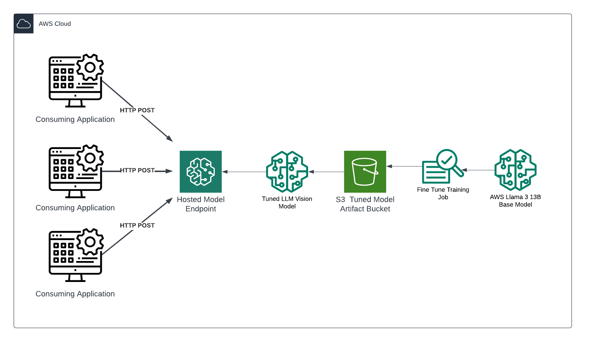

# Overview #

This solution builds a custom vision-llm using AWS services. The model is hosted in a SageMaker model endpoint that is exposed to a private VPC which can be exposed on a public subnet as well if desired.

ECR is used to host the container image which is custom built to use SageMaker libraries to expose it via an API, which can then be called using standard LLM hyper parameters with the encoded image for analysis provided as a 64 bit encoded string. This is later used to process documents for downstream RAG or other document preprocessing tasks required when converting visual information into text.

# Architecture #

## Solution Architecture ##



The solution is built on top of a Llama 2 model, instruction fine-tuned for visual data. The model is also quantized to int 4 to allow for running on compute optimized hardware. The vision-llm is not designed to respond in a chat-like manner, and expects a system prompt with instructions on how to intepret an image along with the image itself.

The model is hosted using an auto-scale policy designed to scale-up the model endpoints depending on the number of requests per minute (RPMs). This can be modified in the solution in the Sagemaker resource section.

# Invoking the Model Endpoint

You can call the model endpoint via the AWS SDK (boto3) using the standard model invocation scripts. Simply incude the name of your SageMaker model endpoint to call, include the system prompt and the encoded image in base64 format. Hyper parameters including max token count and temperature can also be set:

```python
def call_sagemaker(prompt, image_base64, endpoint_name=LLM_SERVICE_ENDPOINT_ADDRESS):
    print("Prompt")
    print(prompt)
    payload = {
        "inputs": [
            [
                {"role": "user", "content": str(prompt), "image": image_base64}
            ]
        ],
        "parameters": {
            "max_tokens": 1024,
            "top_p": 0.8,
            "temperature": 1.0,
            "repeat_penalty": 1.005
        }
    }

    sagemaker_client = boto3.client("sagemaker-runtime")
    payload = json.dumps(payload)
    response = sagemaker_client.invoke_endpoint(
        EndpointName=endpoint_name,
        ContentType="application/json",
        Body=payload
    )
    response_string = response["Body"].read().decode()
    return response_string

response = call_sagemaker(prompt=TEXT, image_base64=base64_string)
json_resposne = json.loads(response)
```

The model endpoint will respond with a json object which will include the generated textual description of the image provided (which can be modified using the system prompt). For example:

 ```python
PROMPT = """
You will be provided with an image of a pdf page or a slide. Your goal is to talk about the content that you see, in technical terms, as if you were delivering a presentation.

If there are diagrams, describe the diagrams and explain their meaning.
For example: if there is a diagram describing a process flow, say something like "the process flow starts with X then we have Y and Z..."

If there are tables, describe logically the content in the tables
For example: if there is a table listing items and prices, say something like "the prices are the following: A for X, B for Y..."

DO NOT include terms referring to the content format
DO NOT mention the content type - DO focus on the content itself
For example: if there is a diagram/chart and text on the image, talk about both without mentioning that one is a chart and the other is text.
Simply describe what you see in the diagram and what you understand from the text.

You should keep it concise, but keep in mind your audience cannot see the image so be exhaustive in describing the content.

Exclude elements that are not relevant to the content:
DO NOT mention page numbers or the position of the elements on the image.
"""
```
You can use the llm_envoke example in the scripts folder for a full end-to-end example of how to envoke a model endpoint.


